# Bookstore simulation

## Description 🚀

The book culture has been reborn in the city of Cali, that is why a very important bookstore is about to open its doors in the Sultana del Valle. This new company dedicated to the sale of books of multiple genres and different languages ​​is characterized by a very particular, innovative and efficient style when it comes to serving its users.

This is how the new book business is working: when the client enters the establishment, the first thing he does is go to section 1 where the digital catalogs are located. A place equipped with a series of touch screens in which not only people can review all the available titles present within the store, but also where they can read initial chapters and even reviews of consulted books. At the end of the virtual interaction with the products, the client obtains a list of ISBN codes of the copies they want to obtain.

Having this list in his/her hands, the client continues on his/her way to section 2 where the search is carried out. This is a place provided with a set of stands where several computers are located and allow very fast consultations. The client enters the ISBN codes into the machine and it indicates the blocks or shelves where to look for the volume of interest. To speed up the process of collecting the copies, this machine sorts the list of books according to the location of the shelves in such a way that the buyer follows the best route (if the book is out of stock, its ISBN doesn't appear on the final sorted list). At this stage, the client can use 3 different sorting algorithms to accomplish this task.

At the end of this phase, the buyer continues his/her transit to section 3 of physical books where he collects those present on his/her list in the order supplied in the previous stage. To facilitate this work for each client, a basket is assigned to him to place the books that he finds, one on top of the other, following the order supplied in the previous stage.

With his/her basket full, the client only has to go to the final point, section 4 of payment. Taking into account the time in which it has entered the store, plus the time he has taken collecting the books from each shelf, the order in which he/she enters the row of cashiers is established. In this case, everyone makes a single queue even if there are several ATM's or service points. When one or more service points are available, as many clients pass as there are available points, to be attended one by one in each of them. Since clients come from the single queue, it is stated that all are served in the same order of arrival. The order of departure varies, since it depends on the time it takes for each person to be served in the service point (number of books to be purchased). It should be noted that since the books are in a basket, the last book added is the first one billed and then packed.

Below, an example is shown:

Shelves:

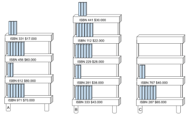

5 clients when exiting section 1:

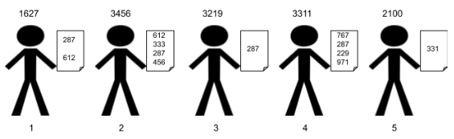

5 clients when exiting section 2:

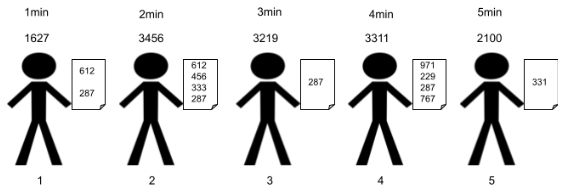

Each customer leaves in the order supplied with a unit of time difference between them (example: one minute).

Line to pay after picking up the books:

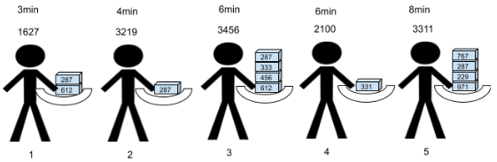

Each client takes 1 unit of time to collect a book, therefore, the total time when leaving section 3 is the previous value from section 2 plus the time taken to collect the copies. Now, from that time, the order of the payment queue is established. If two users take the same time, the one that was before the exit of the previous section comes out first.

Payment process having 3 cashiers:

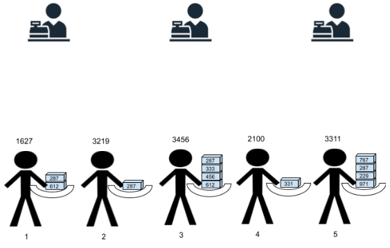

Time 0:

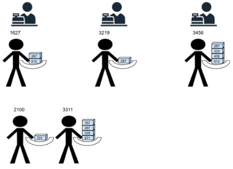

Time 1:

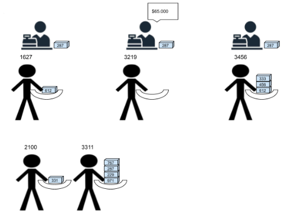

Time 2:

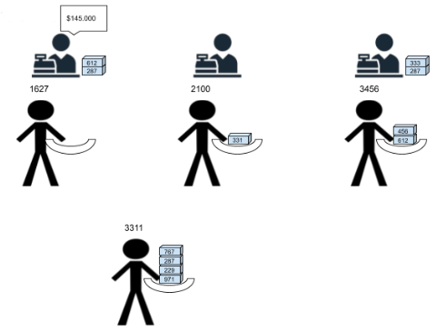

Time 3:

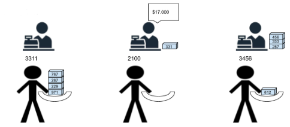

Time 4:

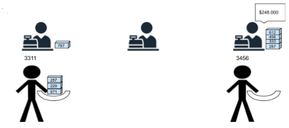

Time 5:

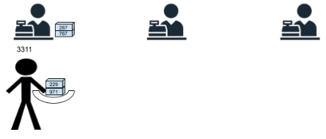

Time 6:

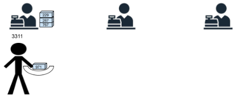

Time 7:

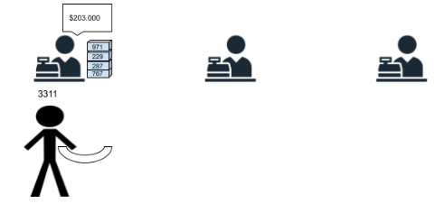

Note: The order in which the clients' books are packed is given taking into account the heap that the cashier has next to him. The one that is on top is obviously the first book to pack up and so on.

## Documentation 📃

Check the engineering method, the functional requirements, the UML Class Diagram design, the data structures TAD design, the JUnit tests design, and the time and spatial complexity analysis of algorithms [here](docs/EngineeringMethod.pdf)

## Technical conditions 🛠️

- Programming Language 💱 : Java 8
- Operating systems used 💻 : Windows 10 Home Single and MacOS Big Sur
- Integrated Development Environment used 👨🏻‍💻 : Visual Studio Code v. 1.54.3 and Eclipse IDE v. 4.17
- Installation 🔧 : Click on Code, then on Download ZIP.

## Authors 🖊️

[Juan-dev123](https://github.com/Juan-dev123) 
[TheLordJuanes](https://github.com/TheLordJuanes) 
[jose-2001](https://github.com/jose-2001)